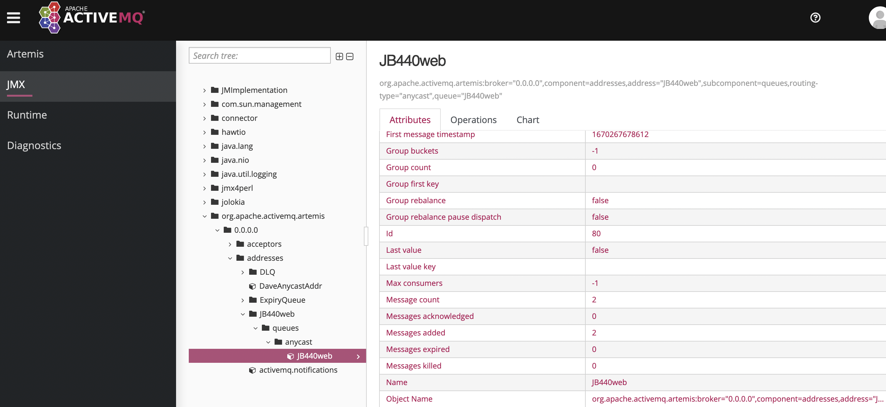

# Simple AMQ Metrics Alerting

This repo inteads to provide a basic monitoring application
for a set of ActiveMQ Artemis brokers. It leverages Apache
Camel and Spring Boot to provide an application that
establishes a connection to a JMX RMI port to view 
information provided by a set of broker MBeans.

Based on a set of configurable thresholds, the application
can then send an alert email when a threshold is exceeded.

Optionally, a summary report of the broker can be sent via
email at a user defined periodic rate.

# Design Considerations

It is understood that there are many options available
to monitor a Java Application such as an ActiveMQ Artemis
broker. The broker provides a web console out-of-the-box that
can be used to view the current state.

Other open source solutions, such as Prometheus, can be used
to monitor. And if running in an OpenShift / kubernetes 
environment, linking your application metrics to the cluster
provided Alert Monitoring UI can be very useful.

Red Hat documentation provides an overview of monitoring
considerations.  This can be found at the following 
location: `https://access.redhat.com/documentation/en-us/red_hat_amq_broker/7.10/html/managing_amq_broker/assembly-br-monitoring-broker-runtime-metrics_managing#doc-wrapper`

However, there are environments where OpenShift is not 
available and installing additional monitoring applications
just is not possible for a variety of reasons.

This application intends to provide the most basic
form of monitoring and alerting.

# Development Environment

In order to run this applicaiton, there needs to be
at least one broker to monitor as well as an SMTP
server that receives the alerts.

The broker will need to open the JMX RMI port
so that remote access to MBeans is possible.

This is accomplished by editing the `etc/managment.xml`
file and configuring a `connector` stanza in the xml.

By default, there is a commented definition, so in 
most cases you simply need to uncomment the definition.
Once uncommented, you can then add a connector-host to the
definition.

The final result will look like this:

```
<management-context xmlns="http://activemq.apache.org/schema" >
   <connector connector-port="1099" connector-host="192.168.x.x" />
   ...
```

Then you will need to provision an SMTP server. I found the 
easiest way to accomplish this is by provisioning MailHog `http://github.com/mailhog/MailHog`.

Run the following command, which will run a server on port 1025 and
a web portal on 8025.

`docker run -p 1025:1025 -p 8025:8025 mailhog/mailhog`

# Application Configuration

Here is an example of the amq properties definition:

```
amq:
  brokers:
    -
      brokerName: artemis
      username: joe
      password: joe
      host: 192.168.0.18
      jmxrmiPort: 1099
      # active, passive
      role: active
      clustered: true
      addressesToMonitor:
        - DLQ
        - ExpiryQueue
        - TEST
```

This property intends to define the brokers to be monitored,
as well as various options.

- brokerName: This is the name of the broker which will be used in the alert.
- username: AMQ Artemis username, which requires admin role.
- password: AMQ Artemis password for the username provided.
- host: AMQ IP address
- jmxrmiPort: The port defined in the management.xml
- role: The intended role of the broker. active|passive
- clustered: If the broker is intended to be clustered.
- addressesToMonitor: Unbounded list of Queues that are monitored.

The following defines the SMTP server properties:

```
smtp:
  host: localhost
  port: 1025
  username: joe
  password: joe
  fromEmail: joe@joe.com
  contentType: text/xml
  
```

Application properties / alert Thresholds

```
application:
  alert: 
    enabled: true
    period: 30000
    broker-thresholds:
      connections: 1
      totalConnections: 30
      diskStoreUsage: 0.10
      addressMemoryPercentage: 0.1
    address-thresholds:
      consumers: 0
      messageCount: 1
  summary:
    enabled: true
    period: 60000 
    
```

This stanza allows for the configuration of alert
thresholds, as well as the summary report.

- alert: configurations for alerts
-- enabled: Whether to determine / send Broker Alerts
-- period: (milliseconds) internal to determine if an alert is present
-- broker-thresholds: list of broker alert thresholds, where if the number is exceeded an alert is sent.
-- address-thresholds: list of address alert threshold, where if the number is exceeded an alert is sent.
- summary: configuration for summary report
-- consumers: threshold number of expected consumers for the address (queue | topic)
-- messageCount: threshold number of messages present on the address.

# Building / Installation

- Clone this repository
- A sample shell script is included in the home directory of repo ```amq-alerts/mycurl.sh```
- Note: the script is pointing to a local instance of ActiveMQ/Artemis.  Please update the according to your own environment.
- Edit ```src/main/resources/application.yml``` with following changes according to your specific environment
-- configure SMTP server properties
-- configure AMQ broker properties
-- configure Alert thresholds. 

```shell
mvn spring-boot:run
```
# Steps to Create a New Alert (Message Ack Count Example)

- In ActiveMQ Console in the left-hand side ```JMX``` section, select your queue and choose an attribute you want to alert on (e.g. we are using ```MessagesAcknowledged``` attribute for this example)



- Update ```src/main/resources/application.yml``` and add a new entry ```messageAckCount``` to ```application.alert.address-thresholds```
```shell
application:
  alert: 
    enabled: true
    period: 30000
    broker-thresholds:
      connections: 1
      totalConnections: 30
      diskStoreUsage: 0.10
      addressMemoryPercentage: 0.1
    address-thresholds:
      consumers: 3
      messageCount: 0
      messageAckCount: -1
```
- Update ```src/main/resources/QueueAlertTemplate.vm``` to add new custom email alert message for Message Ack Count
```shell
#if( ${headers.MessageAckCountAlert} == "true" )
The ${headers.queueName} queue on the broker ${headers.brokerName} has Unack message
count of ${headers.MessageAckCountCurrent}, and the threshold for 
consumer count is ${headers.MessageAckCountThreshold}.
#end
```
- Update ```src/main/java/com/redhat/consulting/config/AddressAlertThresholds.java``` with following changes:
- Add new internal local variable ```private int messageAckCount```
- Add new getter/setting for messageAckCount
```shell
   public int getMessageAckCount() {
		return messageAckCount;
	}

	public void setMessageAckCount(int messageAckCount) {
		this.messageAckCount = messageAckCount;
	}
```
- Update ```src/main/java/com/redhat/consulting/processors/DetermineQueueAlertProcessor.java``` with following changes:
- Add a new conditional block in the ```process``` method
```shell
if (queueControl.getMessagesAcknowledged() > addressAlertThresholds.getMessageAckCount()) {
			exchange.getIn().setHeader("addressAlertExists", true);
			exchange.getIn().setHeader("MessageAckCountAlert", true);
			exchange.getIn().setHeader("MessageAckCountCurrent", queueControl.getMessagesAcknowledged());
			exchange.getIn().setHeader("MessageAckCountThreshold", addressAlertThresholds.getMessageAckCount());
}
```
